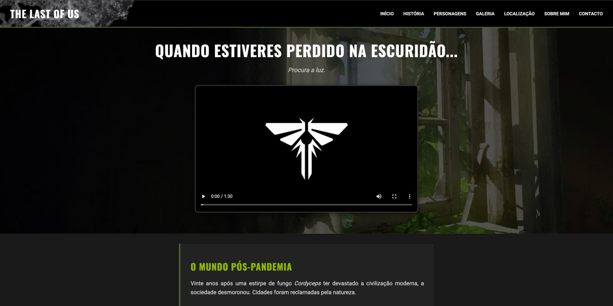

# 🍄 Endure & Survive | The Last of Us Tribute

> "Quando estiveres perdido na escuridão, procura a luz."

   

## 🌿 Sobre o Projeto

Este projeto é um tributo ao universo de **The Last of Us**, desenvolvido como desafio final de **Fundamentos Web**.

O objetivo foi criar uma _Landing Page_ imersiva que simula um guia de sobrevivência, aplicando conceitos modernos de desenvolvimento Front-end. O código foi construído para ser "à prova de apocalipse": **semântico, acessível, responsivo e interativo**.

🔗 **Acesse o projeto online:** [Endure and Survive](https://debsandrade.github.io/Endure-And-Survive/)

## 🔦 Funcionalidades e Destaques

O projeto evoluiu de uma estrutura básica para uma experiência completa:

### 🏗️ Estrutura e Semântica (HTML5)

- Uso rigoroso de tags semânticas (`<header>`, `<main>`, `<article>`, `
`) para melhor SEO e acessibilidade.
- Textos alternativos (`alt`) em todas as imagens.

### 🎨 Design e Estilo (CSS3)

- **Layout Responsivo:** Adaptação fluida para Desktop e Mobile usando **Flexbox** e **Media Queries**.
- **Animações 3D:** "Flip Cards" na secção de infetados (CSS puro com `transform: rotateY`).
- **Galeria Interativa:** Efeito de fotos polaroid espalhadas.
- **Variáveis CSS:** Uso de `:root` para gestão eficiente da paleta de cores temática.

### ⚡ Interatividade (JavaScript)

- **Menu Hambúrguer:** Navegação mobile totalmente funcional com animação do ícone.
- **Formulário de Contacto:** Validação de envio e feedback visual ("Transmissão de rádio") sem recarregar a página.

## 🛠️ Tecnologias Utilizadas

- **HTML5:** Estrutura óssea e semântica.
- **CSS3:** Estilização, animações, Grid e Flexbox.
- **JavaScript (Vanilla):** Manipulação do DOM e lógica de interação.
- **Git & GitHub:** Versionamento e hospedagem (GitHub Pages).

## 🗺️ Roteiro de Desenvolvimento (Roadmap)

- [x] **Semana 1:** Estrutura HTML5 Semântica e Conteúdo.
- [x] **Semana 2:** Estilização Visual (Layout, Cores, Tipografia).
- [x] **Semana 3:** Responsividade, JavaScript e Refinamento Final.

---

## 📸 Screenshots

  

---

## 📚 Referências e Créditos

O desenvolvimento deste projeto contou com materiais de apoio para a criação do Menu Hambúrguer Responsivo:

- [Codepen - Joseph Sayegh](https://codepen.io/joesayegh/pen/jOEVPKO)
- [DEV Community](https://dev.to/ljcdev/easy-hamburger-menu-with-js-2do0)

  Desenvolvido por <strong>Débora Andrade</strong> 👩‍💻 
  <i>"Resistir e Sobreviver."</i>
    
  
  

